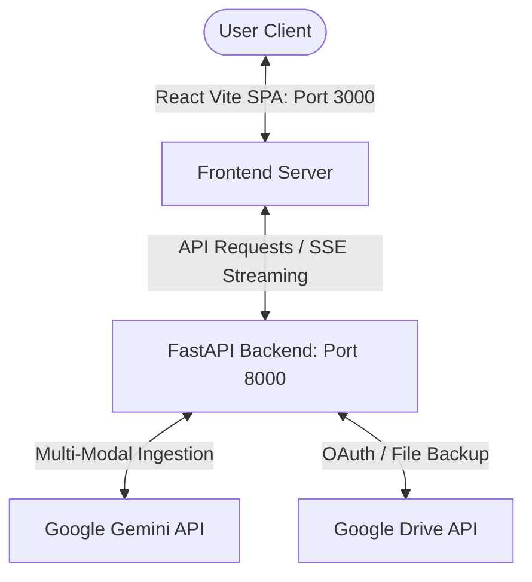

<div align="center">


### The Intelligent Open-Source AI Document Companion & Study Suite

[](https://opensource.org/licenses/MIT)
[](https://vite.dev)
[](https://fastapi.tiangolo.com)
[](https://deepmind.google/technologies/gemini/)

[Explore features](#-key-features) • [Get Started](#-getting-started--setup) • [Architecture](#-system-architecture)

</div>

---

DocMind.AI is a premium, open-source, full-stack document analyzer designed to process, extract, and convert static documents into active knowledge repositories. Backed by a high-performance **Python FastAPI** service, a reactive **Vite + React** SPA, and powered by **Google Gemini models**, DocMind.AI delivers live synopsis, semantic chat, multi-lingual translations, and interactive practice suites.

---

## ⚡ System Architecture



---

## ✨ Key Features

DocMind.AI provides a series of high-level features built to streamline document consumption:

### 📂 Smart Library Dashboard
- **Translucent Drag & Drop Ingestion**: Upload files instantly with active tracking of file size and ingest progress.
- **Persistent Inventory**: Saves your inventory across refreshes via local storage syncing.
- **Analytics Metrics**: Real-time evaluation dashboard tracking total documents, total read pages, AI answers, and response latency.

### 🛠️ Evaluation Studio (Document Workspace)
Each uploaded document receives a fully insulated, viewport-fitted workspace featuring a custom horizontal tab controller:
- **💬 Streamed Interactive Chat**: Query document details in natural language with token-by-token server-sent events (SSE) and strict citations.
- **📄 Executive Summary**: View a structured summary presenting document objectives, target takeaways, and action points.
- **📌 Key Insights**: Dig into detailed bullet points representing core semantic structures.
- **🧠 Quiz Generator**: Synthesize multiple-choice interactive exams based on document claims.
- **🎓 Concept Flashcards**: Flip and study concepts with 3D transition interactive flashcards.
- **🌐 Translation Studio**: Instantly localize summaries, definitions, and questions into twelve world languages.
- **💾 Export Notes**: Download a complete compilation of your synopsis, takeaways, and quiz scores as clean Markdown logs.

### ☁️ Cloud Drive Synchronization
- **Implicit Google OAuth**: Login directly with your Google account.
- **Secure Backup**: Automatically sync and backup ingested files directly into your personal Google Drive account in a designated `DocMind.ai Workspace` folder.

---

## 🛠️ Technology Stack

| Layer | Technologies |
| :--- | :--- |
| **Frontend** | React SPA, TypeScript, Vite, Tailwind CSS, Motion, Lucide Icons |
| **Backend** | Python 3.10+, FastAPI, Uvicorn, Google GenAI SDK |
| **File Parsers** | PyPDF (PDF text), Mammoth (DOCX structure), native Zip/XML parser (PPTX slides) |

---

## 📁 Repository Structure

```text
├── backend/                  # Python FastAPI Microservice
│   ├── main.py              # Application Root & Gemini Model SDK Integration
│   ├── auth.py              # Google OAuth Endpoint Verification
│   ├── drive_service.py     # Google Drive folder/file backup utilities
│   └── requirements.txt     # Python PIP packages
├── frontend/                 # React Client Application
│   ├── src/
│   │   ├── components/      # UI components (ChatInterface, QuizView, etc.)
│   │   ├── App.tsx          # Workspace Router & Root Controller
│   │   ├── index.css        # Tailwind directives & CSS Grid definitions
│   │   └── types.ts         # TypeScript structural definitions
│   ├── index.html           # Document HTML entrypoint
│   └── package.json         # Node build scripts
├── LICENSE                   # MIT License
└── README.md                 # Documentation
```

---

## ⚙️ Getting Started & Setup

Follow these steps to deploy a local instance of DocMind.AI for development:

### Prerequisites
- **Node.js** (v18 or higher)
- **Python** (v3.10 or higher)
- **Gemini API Key** (Get one from [Google AI Studio](https://aistudio.google.com))

---

### 💻 Local Installation Guide

#### 1. Setup Backend Server (FastAPI)
1. Navigate to the backend directory:
   ```bash
   cd backend
   ```
2. Initialize virtual environment:
   ```bash
   python -m venv venv
   # On Windows:
   .\venv\Scripts\activate
   # On macOS/Linux:
   source venv/bin/activate
   ```
3. Install Python requirements:
   ```bash
   pip install -r requirements.txt
   ```
4. Configure API environment variable:
   ```bash
   # Windows PowerShell:
   $env:GEMINI_API_KEY="AIzaSyYourGeminiAPIKeyHere"
   # Windows Command Prompt:
   set GEMINI_API_KEY="AIzaSyYourGeminiAPIKeyHere"
   # macOS/Linux:
   export GEMINI_API_KEY="AIzaSyYourGeminiAPIKeyHere"
   ```
5. Run the ASGI server:
   ```bash
   uvicorn main:app --host 127.0.0.1 --port 8000 --reload
   ```

#### 2. Setup Client Application (Vite + React)
1. Open a new terminal instance and enter the frontend directory:
   ```bash
   cd frontend
   ```
2. Install npm dependencies:
   ```bash
   npm install
   ```
3. Start the dev server:
   ```bash
   npm run dev
   ```
4. Open your browser and navigate to **[http://localhost:3000](http://localhost:3000)**.

---

## 📄 License

DocMind.AI is distributed under the MIT License. See [LICENSE](file:///c:/Users/akano/Documents/IBMInternship/Analyserai/Analyzer.AI/LICENSE) for more details.
