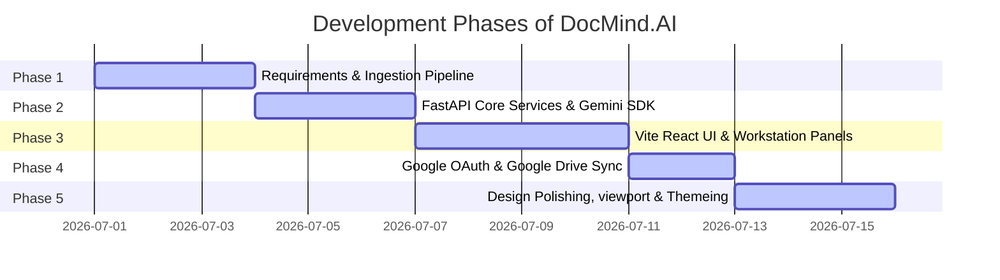
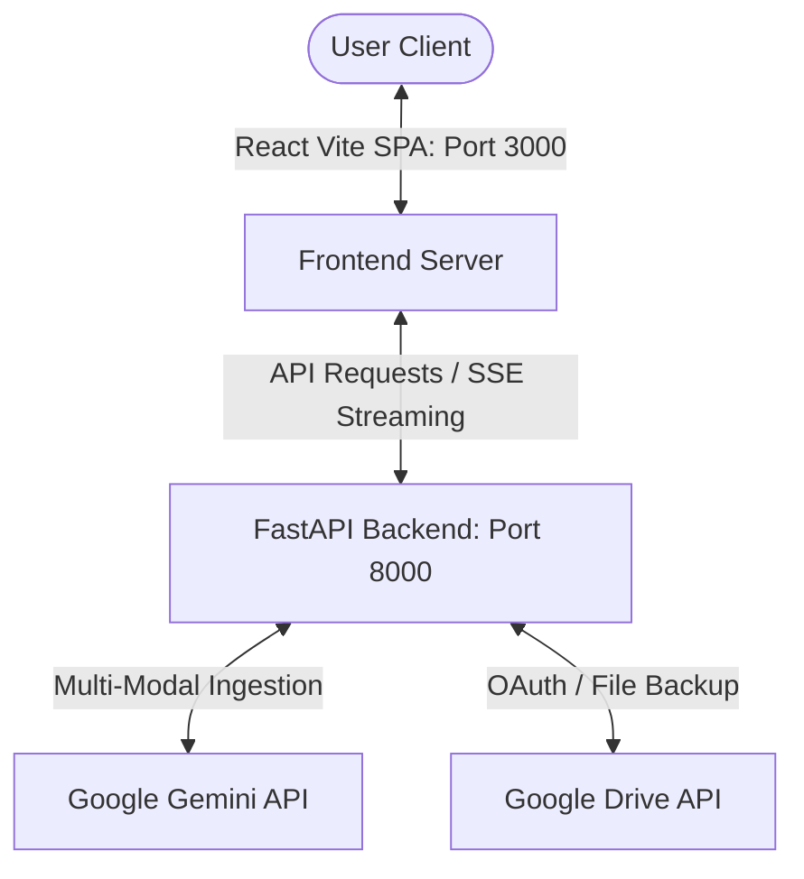

# Project Development Report: DocMind.AI

## 1. Application Overview & Tech Stack

### High-Level Architecture
DocMind.AI is built on a decoupled full-stack architecture:
* **Frontend Client (Vite + React)**: A single-page application (SPA) focused on clean, viewport-fitted UI components and low-latency interaction logic. Uses `motion` for 3D card flips.
* **Backend Microservice (FastAPI)**: An asynchronous REST server that handles file validation, multi-format text extraction, session tokens, and streams Gemini model responses.

### Tech Stack Details
* **Frontend**: React (SPA), TypeScript, Vite, Tailwind CSS, Lucide React, Motion.
* **Backend**: Python 3.10+, FastAPI, Uvicorn, Google GenAI SDK, PyPDF, Mammoth (DOCX), zipfile/XML slide parser (PPTX).
* **Storage & Auth**: Google OAuth (implicit login), LocalStorage (client list state), Google Drive API (cloud synchronization).

---

## 2. Prompting Strategy & Frameworks Used

DocMind.AI utilizes two primary prompting patterns to interface with the Gemini API:

### A. Structured Ingestion Outliner (JSON Schema Constraint)
During file upload, the backend directs Gemini to return a structured analysis of the text.
* **Framework**: Structured Outputs (JSON Schema constraint).
* **Sample Prompt**:
```text
You are an expert Document Analyst. Analyze the attached document and provide a highly professional, comprehensive analysis.
Format your response as a JSON object with fields: 
- title: string (descriptive summary title)
- documentType: string (e.g. Research Paper, Slide Deck, Invoice)
- executiveSummary: string (dense paragraphs of main thesis)
- keyTakeaways: array of strings (core logical takeaways)
- actionItems: array of strings (immediate action plans)
- fileStats: object containing:
    - pages: string
    - wordCount: string
    - readingTime: string
```

### B. Interactive Chat Context Retrieval (Streamed SSE)
For chat queries, the prompt constrains the model's domain search space to prevent hallucinations and generate precise source citations.
* **Framework**: Contextual Grounding.
* **Sample Prompt**:
```text
You are an AI Assistant ground in the attached document context. Answer the user's query utilizing only the facts, figures, and claims present in the context.
If the information is not present, state that you cannot find it in the document.
Context:
[Ingested Document Text]

User Query:
{message}
```

---

## 3. Phase-by-Phase Development Summary



* **Phase 1 (Ingestion & Setup)**: Structured directory boundaries; implemented basic file routers for PDF, DOCX, and images.
* **Phase 2 (Gemini Integration)**: Established FastAPI endpoints; implemented Server-Sent Events (SSE) stream protocols for low-latency responses; created Gemini SDK wrappers.
* **Phase 3 (Frontend Layouts)**: Created main dashboard tabs (Chat, Summary, Key Points, Quiz, Flashcards, Translate). Designed interactive 3D flappable flashcards and quiz feedback UI.
* **Phase 4 (Cloud Sync)**: Configured Google OAuth login scopes; built background upload synchronization pipeline backing up files directly to user's Google Drive.
* **Phase 5 (Visual Refinement & Viewport Limits)**: Restructured app to fit strictly inside `100vh` boundaries with internal scrolling; applied Material You/Android 16 glassmorphic overlays and subtle grid background patterns. Added slide deck (.pptx) extraction parser.

---

## 4. Application Architecture & Data Flow



The system data flow starts with user authentication through Google OAuth, after which the document ingestion pipeline triggers. Raw PDF, DOCX, images, and PPTX slide formats are parsed asynchronously on the backend. The parsed text frames or base64 streams are securely passed to the `gemini-3.5-flash` endpoint using structured output configurations to formulate summaries and test configurations.

---

## 5. Challenges Encountered & Resolutions

### Challenge 1: Multi-Format Parsing Failures (specifically slide decks)
* **Issue**: The server failed to ingest presentation slides (`.pptx` files) because binary ZIP files were decoded as UTF-8 fallback, causing parsing failures.
* **Resolution**: Built a lightweight XML element parsing utility in `main.py` using python's built-in `zipfile` and `xml.etree.ElementTree` to parse slides slide-by-slide, extracting text frames dynamically without heavy external dependencies.

### Challenge 2: Google OAuth Redirection state loss
* **Issue**: Redirecting the client window for OAuth validation lost the uploaded files array in transient state.
* **Resolution**: Implemented client-side state replication saving the library list locally in `localStorage` under `docmind_uploaded_docs`. On redirect, the array is re-hydrated.

### Challenge 3: Page Layout Scrolling Overflow
* **Issue**: Layouts overflowed vertically, requiring the user to scroll the viewport to see actions or chats, which disrupted the web app dashboard experience.
* **Resolution**: Restructured both Dashboard and Library layouts with strict `h-screen w-screen flex flex-col overflow-hidden` bounds. Fixed header and tab navigation heights, enabling internal, isolated scrollable areas (`overflow-y-auto`) for the content.

---

## 6. Key Learnings & Reflection
* **Multi-Modal SDK Strength**: Leveraging Gemini's native multi-modal ingestion (sending raw PDF/Image bytes directly alongside prompts) provides a massive improvement over manual string parsing, especially for document structures containing charts or images.
* **UX/Aesthetics Matter**: Aligning layouts to strict viewport constraints (`100vh` limits) and styling cards with transparency overlays (glassmorphism) elevates the application from a raw prototype to a premium product.
* **Loose Dependencies Yield Stability**: Building custom text parsers (like the PPTX slide xml reader) rather than relying on bloated libraries decreases server bundle size, reduces deployment vulnerabilities, and improves runtime performance.
